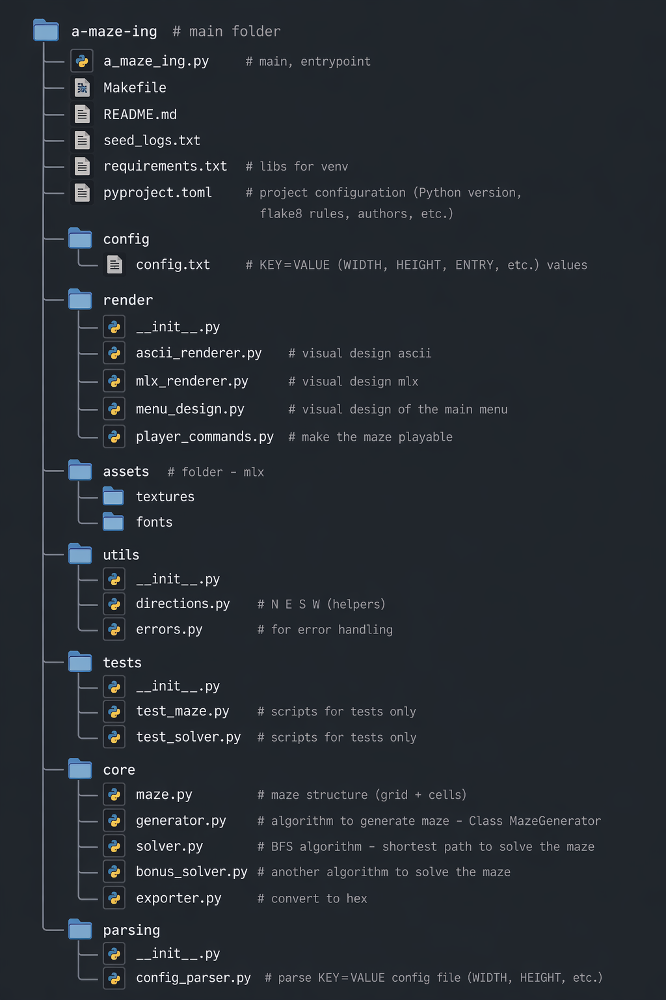

```bash

a-maze-ing # main folder
|-a_maze_ing.py # main, entrypoint
|-Makefile
|-README.md
|-seed_logs.txt
|-requirements.txt # libs for venv
|-pyproject.toml # project configuration (Python version, flake8 rules, authors, etc.)
|
|__config # folder
|  |__config.txt # KEY=VALUE (WIDTH, HEIGHT, ENTRY, etc.) values
|
|__render # folder
|  |__ __init__.py
|  |__ascii_renderer.py # visual design ascii
|  |__mlx_renderer.py # visual design mlx
|  |__ menu_design.py # visual design of the main menu
|  |__player_commands.py # make the maze playable
|
|__assets # folder - mlx
|   |__textures
|   |__fonts
|   |__42_pattern.txt # 42 in ascii design
|__utils # folder
|
|  |__ __init__.py
|  |__ directions.py # N E S W (helpers)
|  |__ errors.py # for error handling
|
|__tests # folder
|  |__ __init__.py
|  |__test_maze.py  # scripts for tests only
|  |__test_solver.py # scripts for tests only
|
|__core # folder
|  |__maze.py # maze structure (grid + cells)
|  |__generator.py # algorithm to generate maze - Class MazeGenerator
|  |__solver.py # BFS algorithm - shortest path to solve the maze
|  |__bonus_solver.py # another algorithm to solve the maze
|  |__exporter.py # convert to hex
|
|__ parsing # folder
|  |__ __init__.py
|  |__ config_parser.py # parse KEY=VALUE config file (WIDTH, HEIGHT, etc.)

```
 


# 🐍 Virtual Environment: Instructions

Short guide to create an isolated Python environment, install project dependencies, and manage activation/deactivation both on windows and linux.

### Create
```bash
python3 -m venv venv
```

### Activate

## Linux / macOS
```bash
source venv/bin/activate
```

## Windows (CMD)
```bash
venv\Scripts\activate
```

## Install requirements (on venv)
```bash
pip install -r requirements.txt
```

## Deactivate
```bash
deactivate
```

## 📦 Config Parser

### ✅ Status: Complete (for now)

#### Features:

- Reads the configuration file  
- Ignores empty lines and comments  
- Validates line format (`KEY=VALUE`)  
- Detects duplicate keys  
- Ensures all mandatory required keys are present  
- Displays error messages if needed  